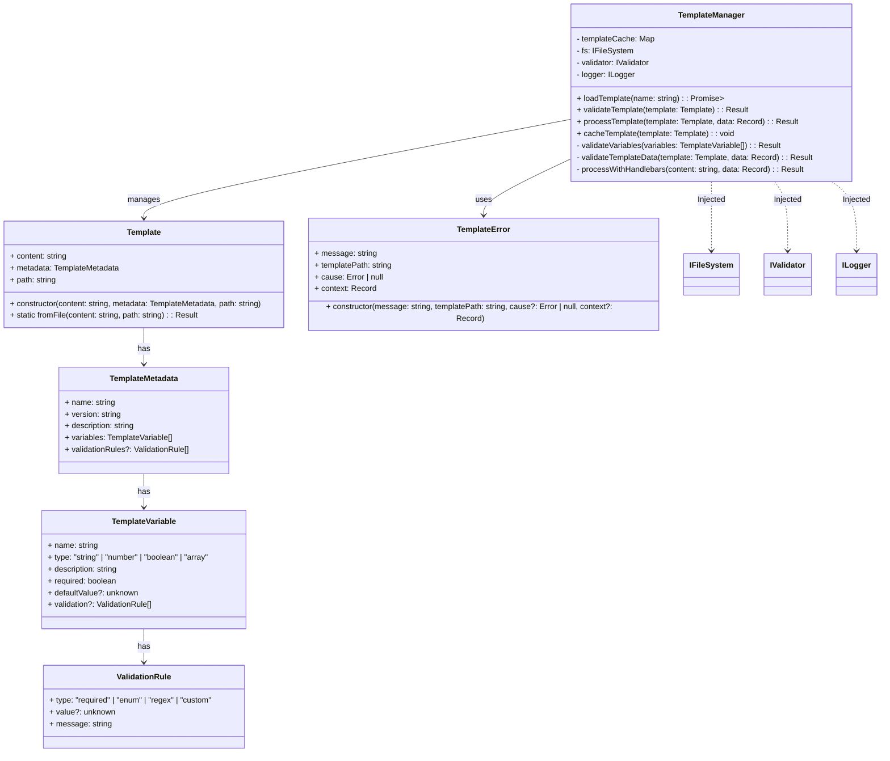
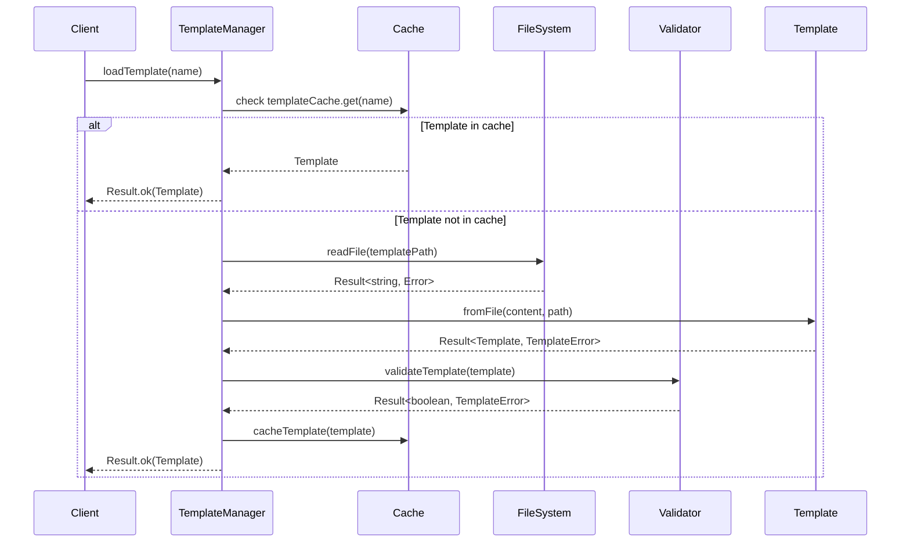
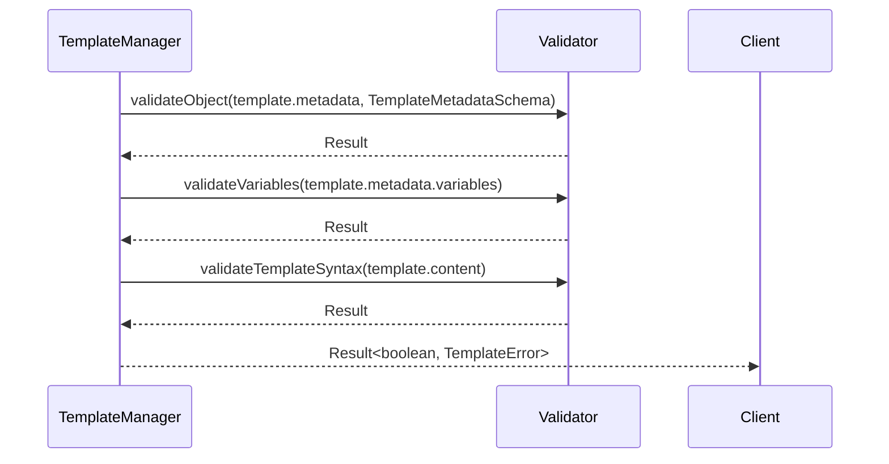
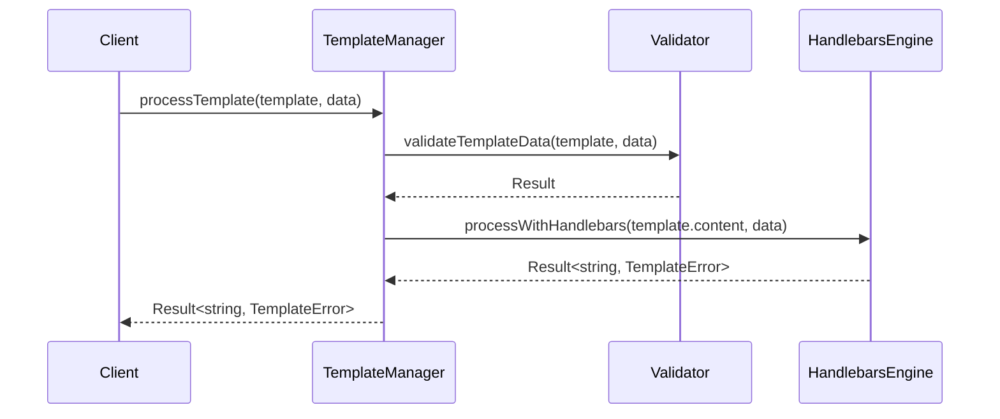
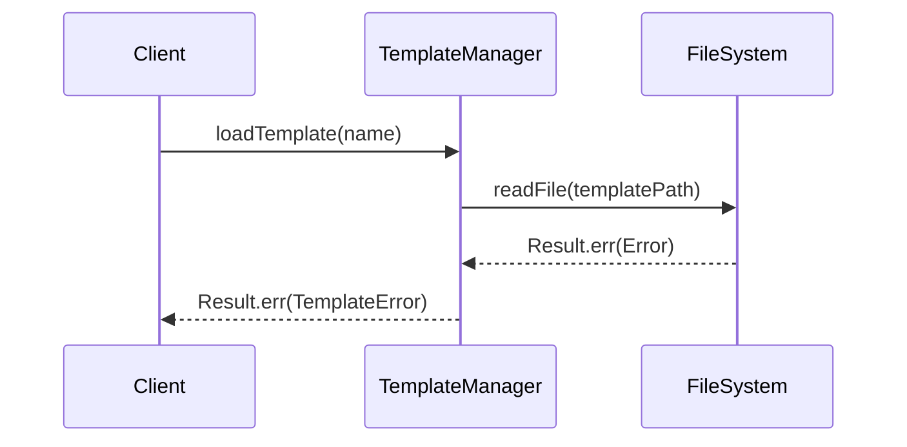

# Template Management System Design

## 1. Overview

The Template Management System (TMS) is responsible for loading, validating, processing, and caching templates in the RooCode Generator. It must be type-safe, follow SOLID principles, use dependency injection, and handle errors explicitly with the Result type pattern as per ADR-0001.

---

## 2. Class Diagram



---

## 3. Sequence Diagrams

### 3.1 Template Loading Process



### 3.2 Template Validation Flow



### 3.3 Template Processing with Variable Substitution



### 3.4 Error Handling Scenario (Template Loading Failure)



---

## 4. Interface Definitions

```typescript
// Template-related data structures
export interface TemplateMetadata {
  name: string;
  version: string;
  description: string;
  variables: TemplateVariable[];
  validationRules?: ValidationRule[];
}

export interface TemplateVariable {
  name: string;
  type: "string" | "number" | "boolean" | "array";
  description: string;
  required: boolean;
  defaultValue?: unknown;
  validation?: ValidationRule[];
}

export interface ValidationRule {
  type: "required" | "enum" | "regex" | "custom";
  value?: unknown;
  message: string;
}

// Template Manager Interface
export interface ITemplateManager {
  loadTemplate(name: string): Promise<Result<Template, TemplateError>>;
  validateTemplate(template: Template): Result<boolean, TemplateError>;
  processTemplate(template: Template, data: Record<string, unknown>): Result<string, TemplateError>;
  cacheTemplate(template: Template): void;
}

// TemplateError class
export class TemplateError extends Error {
  constructor(
    message: string,
    public readonly templatePath: string,
    public readonly cause: Error | null = null,
    public readonly context: Record<string, unknown> = {}
  ) {
    super(message);
    this.name = "TemplateError";
  }
}
```

---

## 5. Error Handling Strategy

- **Error Types**: Use a dedicated `TemplateError` class extending `Error` to encapsulate error message, template path, underlying cause, and contextual data.

- **Error Propagation**: All operations that can fail return a `Result<T, TemplateError>` type, enforcing explicit handling of success and failure cases.

- **Recovery Strategies**:
  - Cache hits avoid file system access, improving performance and reducing error surface.
  - Validation failures return detailed errors with context for diagnostics.
  - Processing errors wrap underlying template engine errors with context.
  - Clients can inspect `TemplateError` details to decide on retries, fallbacks, or user notifications.

---

## 6. Design Decisions and Rationale

- **Use of Result Type**: Ensures explicit error handling and avoids exceptions leaking unexpectedly, improving robustness and testability (per ADR-0001, docs/architecture/decisions/0001-typescript-oop-refactor.md:1-40).

- **Dependency Injection**: Injecting `IFileSystem`, `IValidator`, and `ILogger` promotes loose coupling and testability (docs/specs/template-management-system.md:70-140).

- **Template Caching**: Improves performance by avoiding repeated file reads and parsing (docs/specs/template-management-system.md:75-90).

- **Validation Layers**: Multi-step validation ensures template metadata, variables, and syntax correctness before processing (docs/specs/template-management-system.md:108-140).

- **Error Context**: Including context in errors aids debugging and operational monitoring (docs/specs/template-management-system.md:170-180).

---

## 7. Implementation Phases

1. Define interfaces and data structures.
2. Implement `Template` class with static `fromFile` method.
3. Implement `TemplateManager` with caching, loading, validation, and processing.
4. Implement `TemplateError` class.
5. Write unit tests for each component, focusing on error cases.
6. Integrate with DI container and logger.
7. Document usage and error handling guidelines.

---

## 8. References

- Template Management System Spec: `docs/specs/template-management-system.md:1-180`
- ADR-0001 TypeScript OOP Refactor: `docs/architecture/decisions/0001-typescript-oop-refactor.md:1-40`
- Error Handling System Spec: `docs/specs/error-handling-system.md:1-40`
- Result Type Implementation: `src/core/result/result.ts`
- DI Container Implementation: `src/core/di/container.ts`
