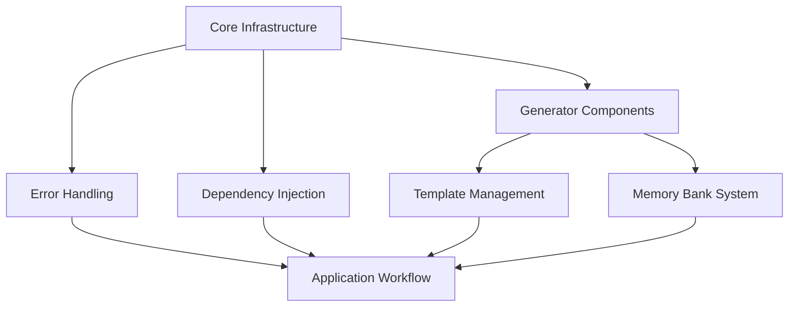
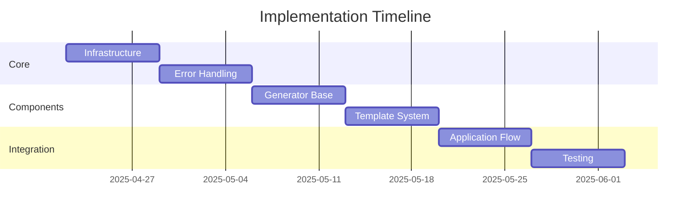

# Technical Specifications and Implementation Plans Summary

## Overview

This document provides a comprehensive overview of all technical specifications and implementation plans for the RooCode Generator TypeScript and OOP refactoring project.

## Implementation Plans

### 1. Core TypeScript and OOP Refactoring

**Location:** `docs/implementation-plans/typescript-oop-refactor.md`

Key Components:

- Result type for error handling
- Type guards implementation
- Service layer architecture
- Dependency injection system
- Interface definitions
- Testing strategy

Implementation Timeline:

- Week 1: Core infrastructure
- Week 2: Service layer migration
- Week 3: Client code updates
- Week 4: Testing and documentation

### 2. Generator Components Refactoring

**Location:** `docs/implementation-plans/generator-components-refactor.md`

Key Components:

- Base generator interface
- Template management system
- File operations abstraction
- Generator implementations
- Orchestration layer

Implementation Timeline:

- Week 1: Core interfaces
- Week 2: Base implementations
- Week 3: Specific generators
- Week 4: Integration and testing

### 3. Memory Bank System

**Location:** `docs/implementation-plans/memory-bank-refactor.md`

Key Components:

- Memory bank validator
- File management system
- Template processing
- Content validation
- Error handling

Implementation Timeline:

- Week 1: Core components
- Week 2: File management
- Week 3: Template system
- Week 4: Integration

### 4. Core Application Workflow

**Location:** `docs/implementation-plans/core-workflow-refactor.md`

Key Components:

- Application container
- Generator orchestration
- CLI interface
- Configuration management
- Error handling

Implementation Timeline:

- Week 1: Container setup
- Week 2: Orchestration
- Week 3: CLI interface
- Week 4: Integration

## Technical Specifications

### 1. Dependency Injection System

**Location:** `docs/specs/dependency-injection-system.md`

Key Features:

- Container implementation
- Service registration
- Dependency resolution
- Lifecycle management
- Testing support

Usage Examples:

```typescript
const container = Container.getInstance();
container.registerSingleton("ILogger", Logger);
container.registerTransient("IGenerator", RulesGenerator);
```

### 2. Error Handling System

**Location:** `docs/specs/error-handling-system.md`

Key Features:

- Result type pattern
- Error hierarchy
- Context preservation
- Recovery strategies
- Logging integration

Usage Examples:

```typescript
async function readConfig(): Promise<Result<Config>> {
  try {
    const content = await fs.readFile("config.json");
    return Result.success(JSON.parse(content));
  } catch (error) {
    return Result.failure(new ConfigError("Read failed", error));
  }
}
```

### 3. Template Management System

**Location:** `docs/specs/template-management-system.md`

Key Features:

- Template loading
- Metadata validation
- Variable processing
- Caching system
- Helper functions

Usage Examples:

```typescript
const templateResult = await templateManager.loadTemplate("rules");
const processedResult = await templateManager.processTemplate(templateResult.value, data);
```

## Implementation Dependencies



## Critical Path Components

1. Core Infrastructure

   - Result type
   - Container implementation
   - Base interfaces

2. Error Handling

   - Error hierarchy
   - Result implementation
   - Logging system

3. Generator Foundation

   - Base generator
   - Template system
   - File operations

4. Integration Components
   - Application container
   - Orchestration
   - CLI interface

## Testing Requirements

### 1. Unit Testing

- Component isolation
- Dependency mocking
- Error case coverage
- Type safety verification

### 2. Integration Testing

- Component interaction
- Error propagation
- Configuration handling
- File system operations

### 3. End-to-End Testing

- Complete workflows
- CLI functionality
- File generation
- Error handling

## Documentation Requirements

### 1. API Documentation

- Interface definitions
- Type information
- Usage examples
- Error handling

### 2. Implementation Guides

- Migration steps
- Breaking changes
- Best practices
- Code examples

### 3. Architecture Documentation

- Component relationships
- Data flow
- Error handling
- Extension points

## Migration Strategy

### Phase 1: Preparation

1. Enable strict TypeScript
2. Update dependencies
3. Create new directory structure
4. Set up testing framework

### Phase 2: Core Components

1. Implement Result type
2. Create Container
3. Define base interfaces
4. Set up error handling

### Phase 3: Service Migration

1. Create new services
2. Implement generators
3. Update file operations
4. Add template system

### Phase 4: Integration

1. Create application container
2. Implement orchestration
3. Update CLI interface
4. Add comprehensive tests

## Success Metrics

### 1. Code Quality

- TypeScript strict mode enabled
- No type assertions
- Comprehensive tests
- Clean lint results

### 2. Maintainability

- Clear component boundaries
- Documented interfaces
- Consistent patterns
- Updated documentation

### 3. Performance

- Minimal overhead
- Efficient error handling
- Optimized template processing
- Fast startup time

## Support and Resources

### Documentation

- Implementation Plans: `/docs/implementation-plans/`
- Technical Specs: `/docs/specs/`
- Architecture Decisions: `/docs/architecture/decisions/`

### Development Tools

- TypeScript Configuration
- Testing Framework
- Linting Rules
- VS Code Settings

### Team Resources

- Code Review Guidelines
- Pull Request Template
- Issue Templates
- Migration Guides

## Next Steps

1. Review all technical specifications
2. Set up development environment
3. Begin core infrastructure implementation
4. Follow phased migration plan
5. Run continuous testing
6. Update documentation regularly

## Timeline Overview


