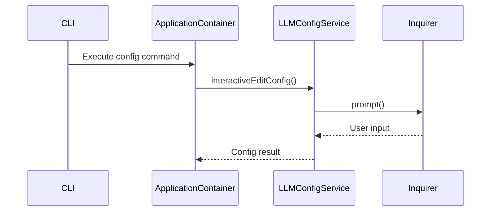

# Config Command Fix Implementation Plan

## Architecture Decision Record

**Context**: Analysis of application-container.ts reveals:

1. DI-managed services architecture
2. Command execution flow through ApplicationContainer
3. LLMConfigService injection pattern

**Decision**: Implement fixes through DI configuration updates and CLI validation

## Component Interactions



## Implementation Subtasks

### 1. Global Command Fix

**Files**:

- package.json
- bin/roocode-generator.ts

**Changes**:

```json
// package.json
{
  "bin": {
    "roocode": "./bin/roocode-generator.js"
  }
}
```

**Verification**:

```bash
npm install -g .
which roocode # Should return path
```

### 2. Inquirer DI Configuration

**Files**:

- src/core/di/registrations.ts
- src/core/di/modules/core-module.ts

**Implementation**:

```typescript
// core-module.ts
container.register('Inquirer', {
  useValue: require('inquirer')
});

// LLMConfigService constructor
constructor(@Inject('Inquirer') private inquirer: typeof import('inquirer'))
```

**Testing**:

```typescript
// llm-config.service.test.ts
test('interactiveEditConfig uses inquirer', async () => {
  const mockPrompt = jest.spyOn(inquirer, 'prompt');
  await service.interactiveEditConfig();
  expect(mockPrompt).toHaveBeenCalled();
});
```

## Verification Checklist

- [ ] Global command available after `npm install -g`
- [ ] `roocode config` completes interactive setup
- [ ] Unit tests for Inquirer integration
- [ ] Updated developer documentation
