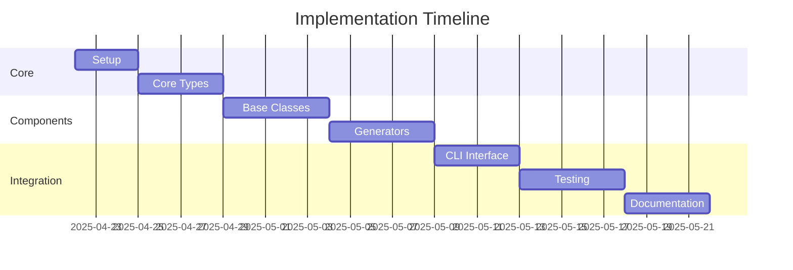

# Next Steps: TypeScript and OOP Refactoring Implementation

## Documentation Created

1. **Implementation Plans**

   - `typescript-oop-refactor.md`: Core TypeScript and OOP improvements
   - `generator-components-refactor.md`: Generator system redesign
   - `memory-bank-refactor.md`: Memory bank system architecture
   - `core-workflow-refactor.md`: Application workflow redesign
   - `master-refactor-plan.md`: Overall implementation strategy
   - `technical-specifications-summary.md`: Comprehensive overview

2. **Technical Specifications**

   - `dependency-injection-system.md`: DI container and patterns
   - `error-handling-system.md`: Result type and error management
   - `template-management-system.md`: Template processing architecture

3. **Developer Resources**

   - `developer-quickstart.md`: Getting started guide
   - `refactoring-checklist.md`: Implementation tracking

4. **Architecture Decisions**
   - `0001-typescript-oop-refactor.md`: Core architectural decisions

## Immediate Next Steps

### 1. Development Environment Setup

```bash
# Update dependencies
npm install typescript@latest @types/node@latest
npm install --save-dev jest @types/jest ts-jest

# Configure TypeScript
npm run tsc -- --init
```

### 2. Core Infrastructure Implementation

1. Create `/src/core` directory:

```typescript
// src/core/result.ts
export class Result<T> {
  private constructor(
    private readonly _isSuccess: boolean,
    private readonly _value?: T,
    private readonly _error?: Error
  ) {}

  static success<T>(value: T): Result<T> {
    return new Result(true, value);
  }

  static failure<T>(error: Error): Result<T> {
    return new Result(false, undefined, error);
  }
}

// src/core/container.ts
export class Container {
  private static instance: Container;
  private readonly services: Map<string, any> = new Map();

  static getInstance(): Container {
    if (!Container.instance) {
      Container.instance = new Container();
    }
    return Container.instance;
  }
}
```

### 3. Initial Team Tasks

1. **Core Team**

   - Set up development environment
   - Implement Result type
   - Create Container class
   - Add base interfaces

2. **Generator Team**

   - Review generator specifications
   - Create base generator interface
   - Implement template system
   - Add file operations

3. **Integration Team**
   - Set up testing framework
   - Create test utilities
   - Implement CI/CD pipeline
   - Add quality checks

## Key Implementation Milestones

### Week 1: Foundation

- [ ] TypeScript strict mode enabled
- [ ] Core types implemented
- [ ] Basic DI container working
- [ ] Initial tests passing

### Week 2: Base Components

- [ ] Generator base classes ready
- [ ] Template system functional
- [ ] File operations working
- [ ] Error handling implemented

### Week 3: Specific Implementations

- [ ] Rules generator updated
- [ ] System prompts generator updated
- [ ] Memory bank generator updated
- [ ] Integration tests passing

### Week 4: Integration and Polish

- [ ] CLI interface complete
- [ ] All generators integrated
- [ ] Documentation updated
- [ ] Full test coverage

## Critical Success Factors

1. **Type Safety**

   - No any types
   - No type assertions
   - Strict checks passing
   - Comprehensive type guards

2. **Error Handling**

   - Result type used consistently
   - Error context preserved
   - Proper error hierarchy
   - Complete error logging

3. **Testing**

   - Unit tests for all components
   - Integration tests for workflows
   - E2E tests for CLI
   - High test coverage

4. **Documentation**
   - Updated API documentation
   - Clear examples
   - Migration guides
   - Architecture documentation

## Support Resources

### Documentation

- Implementation Plans: `/docs/implementation-plans/`
- Technical Specs: `/docs/specs/`
- Architecture Decisions: `/docs/architecture/decisions/`

### Development Tools

- TypeScript Configuration
- Testing Framework
- Linting Rules
- VS Code Settings

### Team Communication

- Daily Stand-ups
- Code Review Process
- Documentation Reviews
- Progress Tracking

## Risk Mitigation

1. **Technical Risks**

   - Regular type checking
   - Continuous integration
   - Automated testing
   - Code review process

2. **Migration Risks**

   - Phased implementation
   - Compatibility layer
   - Feature flags
   - Rollback procedures

3. **Team Risks**
   - Clear documentation
   - Regular training
   - Pair programming
   - Knowledge sharing

## Getting Started

1. Clone the repository
2. Install dependencies
3. Review documentation
4. Set up development environment
5. Start with core components
6. Follow implementation checklist

## Questions and Support

For questions or support:

1. Review documentation
2. Check implementation guides
3. Consult technical specifications
4. Ask team lead
5. Update documentation as needed

## Success Metrics

1. **Code Quality**

   - TypeScript strict checks pass
   - No type assertions
   - Test coverage > 80%
   - Clean lint results

2. **Performance**

   - No significant slowdown
   - Memory usage stable
   - Fast startup time
   - Efficient error handling

3. **Maintainability**
   - Clear component boundaries
   - Documented interfaces
   - Consistent patterns
   - Updated documentation

## Timeline


