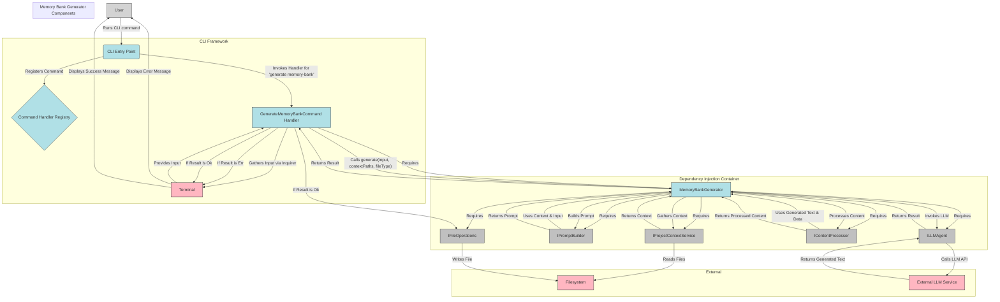

# Implementation Plan: Integrate LLM-driven Memory Bank Generator into CLI

## 1. Overview

This plan details the integration of the completed LLM-driven Memory Bank Generator functionality into the core `roocode-generator` CLI workflow. This integration is a critical step towards achieving the functional alpha version milestone, specifically enabling the generation of a `roocode.json` file based on user input and LLM assistance (memory-bank/ProjectOverview.md:60-61).

The plan outlines the necessary updates to the CLI command structure, how the CLI will interact with the generator and its dependencies, the process for gathering user input, handling generated content, and implementing robust error handling.

## 2. Architectural Design

The integration will extend the existing Modular CLI architecture with a new command handler responsible for orchestrating the memory bank generation process. Dependency Injection will be utilized to integrate the `MemoryBankGenerator` and its associated services.

### 2.1. Component Diagram

The following diagram illustrates the interaction flow between the user, the CLI components, the Memory Bank Generator, and its dependencies:

### 2.2. Data Flow

1.  User executes the `roocode generate memory-bank <fileType>` command.
2.  The CLI Entry Point parses the command and invokes the `GenerateMemoryBankCommand` handler.
3.  The command handler uses `inquirer` to prompt the user for additional input (e.g., context paths) if not provided via arguments.
4.  The command handler calls the injected `MemoryBankGenerator.generate` method, passing the specified `fileType`, gathered `contextPaths`, and desired `outputDir`.
5.  The `MemoryBankGenerator` uses `IProjectContextService` to read content from the specified `contextPaths` via `IFileOperations`.
6.  The `MemoryBankGenerator` uses `IPromptBuilder` to construct a prompt for the LLM, incorporating the gathered context and user input.
7.  The `MemoryBankGenerator` uses `ILLMAgent` to send the prompt to the External LLM Service and receives the generated text.
8.  The `MemoryBankGenerator` uses `IContentProcessor` to process the raw LLM output into the desired memory bank file format.
9.  The `MemoryBankGenerator` returns a `Result<string, Error>` containing either the processed content or an error.
10. The command handler checks the `Result`. If successful, it uses `IFileOperations` to write the generated content to the target file on the Filesystem.
11. The command handler displays a success or error message to the user via the Terminal.

### 2.3. Component Specifications/Updates

- **CLI Entry Point (`src/cli/index.ts` or similar):**
  - **Update:** Register a new command `generate memory-bank` with arguments `<fileType>` and optional options `--context <paths...>`, `--output <path>`.
- **New Command Handler (`src/commands/generate-memory-bank.command.ts`):**
  - **New Component:** `GenerateMemoryBankCommand` class.
  - **Responsibilities:** Parse arguments/options, gather user input via `inquirer`, validate input, obtain `MemoryBankGenerator` and `IFileOperations` via DI, call `memoryBankGenerator.generate`, handle the `Result`, write output file using `IFileOperations`, display status/errors using `chalk` and `ora`.
  - **Dependencies:** `MemoryBankGenerator`, `IFileOperations`, `inquirer`, `chalk`, `ora`.
  - **DI Registration:** Register `GenerateMemoryBankCommand` in the DI container.
- **Memory Bank Generator (`src/memory-bank/MemoryBankGenerator.ts`):**
  - **Update:** Ensure the `generate` method correctly accepts and utilizes `fileType`, `contextPaths`, and `outputDir` parameters. Confirmed correct DI setup for its internal dependencies (progress-tracker/reviews/memory-bank-llm-integration-review.md:132).
- **Dependency Injection Container (`src/registrations.ts` or similar):**
  - **Update:** Register `GenerateMemoryBankCommand`. Verify correct registration of `MemoryBankGenerator` and its dependencies as per the review (progress-tracker/reviews/memory-bank-llm-integration-review.md:141).

## 3. Implementation Strategy

The implementation will follow these steps:

1.  **Define CLI Command:** Add the `generate memory-bank` command definition to the CLI entry point, specifying arguments and options.
2.  **Create Command Handler:** Implement the `GenerateMemoryBankCommand` class in `src/commands/generate-memory-bank.command.ts`, including constructor injection for dependencies.
3.  **Implement Input Gathering:** Use `inquirer` within the command handler's `execute` method to prompt for context paths if the `--context` option is not provided.
4.  **Call Memory Bank Generator:** Invoke the `memoryBankGenerator.generate` method with the collected `fileType`, `contextPaths`, and `outputDir`.
5.  **Handle Generator Result:** Implement logic to check the `Result` returned by the generator.
6.  **Implement File Writing:** If the result is `Ok`, use the injected `IFileOperations` to write the generated content to the determined output path.
7.  **Implement Error Reporting:** If the result is `Err` (from generator or file writing), display a formatted error message using `chalk.red`. Use `chalk.green` for success messages and `ora` for progress indication.
8.  **Register Components:** Add `GenerateMemoryBankCommand` to the DI container registrations (`src/registrations.ts`).
9.  **Integrate with CLI Framework:** Connect the command definition to the registered command handler using the CLI framework's mechanism.

## 4. Error Handling

Error handling will adhere to the `Result<T, E>` pattern (memory-bank/DeveloperGuide.md:210-225).

- The command handler will receive a `Result<string, Error>` from `MemoryBankGenerator.generate`.
- It will check `isOk()` or `isErr()` to determine success or failure.
- If `isErr()`, the `error` property will contain details, which will be displayed to the user using `chalk.red`.
- File writing operations using `IFileOperations` should also return a `Result`, and their errors will be handled similarly.
- Input validation errors within the command handler will be reported using `chalk.red`.
- Clear, user-friendly error messages will be prioritized.

## 5. Technical Considerations and Tradeoffs

- **DI Setup:** Ensure all dependencies are correctly registered and resolved by the DI container.
- **User Input:** Balance interactive prompts (`inquirer`) for user-friendliness with command-line arguments for scriptability. Prompting only when arguments are missing is a good balance.
- **Context Scope:** Define sensible default context paths while allowing user override via `--context`.
- **LLM Latency:** Use `ora` to provide visual feedback during potentially slow LLM calls.
- **Output File Handling:** For the alpha milestone targeting `roocode.json`, overwriting with a confirmation prompt is a reasonable approach. More sophisticated merging can be considered later.
- **Error Detail:** Provide informative but not overly technical error messages to the user.
- **Testability:** Leverage DI to mock dependencies and test the command handler's logic in isolation.

## 6. Risk Assessment and Mitigation

- **LLM API Errors:** Implement robust error handling in `ILLMAgent` and `MemoryBankGenerator`, report specific errors to the user.
- **Insufficient Context:** Provide clear guidance on context paths, use sensible defaults.
- **File Writing Issues:** Use `IFileOperations` for file system interactions, report specific file system errors, prompt before overwriting.
- **LLM Behavior Changes:** Abstract LLM interaction via `ILLMAgent` and Langchain, regularly test, be prepared to update prompt/processing logic.
- **Performance:** Use `ora` for feedback, optimize context gathering.
- **Content Consistency:** Refine prompts and content processing logic based on generated output quality.

## 7. Verification Criteria

- `roocode generate memory-bank --help` displays correct usage.
- Interactive context prompt appears if `--context` is not used.
- Successful generation with valid input creates the output file with expected content and displays a green success message.
- Errors during generation or file writing are caught and displayed as red error messages.
- DI resolves all dependencies without errors.
- Code adheres to development standards and uses `Result` for error handling.

## 8. Memory Bank References

- `memory-bank/ProjectOverview.md:60-61` (Project milestone - generating `roocode.json`)
- `memory-bank/TechnicalArchitecture.md:46` (Use of Inquirer.js)
- `memory-bank/TechnicalArchitecture.md:47` (Use of Chalk and Ora)
- `memory-bank/TechnicalArchitecture.md:120-135` (Component structure and DI patterns)
- `memory-bank/DeveloperGuide.md:210-225` (Error handling standards - Result type)
- `progress-tracker/reviews/memory-bank-llm-integration-review.md` (Details of completed generator, DI fixes, LLM invocation, context/data handling)
