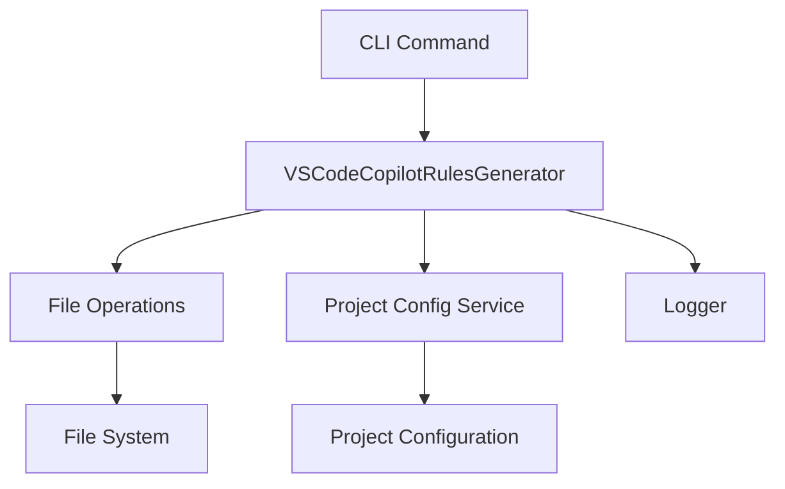

# Implementation Plan: VS Code Copilot Rules Generation

## Overview

This implementation plan outlines the approach to restore the VS Code Copilot rule generation functionality that was previously handled by the script at `old-code/vscode-copilot-rules-generator.ts`. The functionality involves copying rule files, modifying content, and updating settings.json to configure VS Code Copilot behavior.

## Requirements Analysis

The functionality to be restored includes:

1. Copying specific rule files (`architect-rules.md`, `code-rules.md`, `code-review-rules.md`) from the templates/rules directory to the .vscode directory.
2. Copying and modifying the MCP usage guide (`vscode-mcp-usage-guide.md`) to create `mcp-usage-rule.md` in .vscode, appending a specific rule about using MCP tools.
3. Updating the `.vscode/settings.json` file to include references to these generated rule files in the `github.copilot.chat.codeGeneration.instructions` and `github.copilot.chat.reviewSelection.instructions` arrays.

## Architecture Decision

### Integration Approach

**Decision**: Extend the existing `VSCodeCopilotRulesGenerator` class in `src/generators/vscode-copilot-rules-generator.ts` to include the missing functionality.

**Rationale**:

- The existing class already handles VS Code Copilot settings generation
- This approach aligns with the Feature-based project structure (memory-bank/DeveloperGuide.md:79-104)
- It leverages the existing dependency injection and file operations infrastructure

### Component Diagram



## Implementation Details

### 1. Modify VSCodeCopilotRulesGenerator Class

The existing `VSCodeCopilotRulesGenerator` class will be extended to include the rule file copying and settings update functionality. The implementation will follow the modular architecture pattern (memory-bank/TechnicalArchitecture.md:17-48) and leverage the existing File Operations service.

#### Changes to executeGeneration Method

The `executeGeneration` method will be modified to:

1. Copy rule files from templates/rules to .vscode directory
2. Copy and modify the MCP usage guide
3. Update settings.json with rule file references
4. Maintain existing Copilot settings functionality

```typescript
protected async executeGeneration(): Promise<Result<string, Error>> {
  this.logger.info("Executing VSCode Copilot Rules generation...");

  const configResult = await this.projectConfigService.loadConfig();
  if (configResult.isErr()) {
    const errorMessage = configResult.error?.message ?? "Unknown error";
    return Result.err(
      new Error(`Failed to load project config during execution: ${errorMessage}`)
    );
  }

  const projectConfig = configResult.value;
  if (!projectConfig?.baseDir) {
    return Result.err(
      new Error("Project base directory is not defined in the configuration.")
    );
  }

  // 1. Ensure .vscode directory exists
  const vscodeDir = path.join(projectConfig.baseDir, ".vscode");
  const createDirResult = await this.fileOperations.createDirectory(vscodeDir);
  if (createDirResult.isErr()) {
    const errorMessage = createDirResult.error?.message ?? "Unknown error";
    return Result.err(new Error(`Failed to create .vscode directory: ${errorMessage}`));
  }

  // 2. Copy rule files
  const ruleFilesCopyResult = await this.copyRuleFiles(projectConfig.baseDir, vscodeDir);
  if (ruleFilesCopyResult.isErr()) {
    return ruleFilesCopyResult;
  }

  // 3. Copy and modify MCP usage guide
  const mcpGuideResult = await this.copyAndModifyMcpGuide(projectConfig.baseDir, vscodeDir);
  if (mcpGuideResult.isErr()) {
    return mcpGuideResult;
  }

  // 4. Update settings.json
  const settingsUpdateResult = await this.updateSettingsJson(vscodeDir);
  if (settingsUpdateResult.isErr()) {
    return settingsUpdateResult;
  }

  this.logger.info(`Successfully generated/updated VSCode Copilot rules in ${vscodeDir}`);
  return Result.ok("VSCode Copilot rules generated successfully.");
}
```

### 2. Add Helper Methods

Add new helper methods to handle specific parts of the functionality:

#### copyRuleFiles Method

```typescript
/**
 * Copies rule files from templates/rules to .vscode directory
 */
private async copyRuleFiles(baseDir: string, vscodeDir: string): Promise<Result<void, Error>> {
  this.logger.debug("Copying rule files to .vscode directory...");

  const ruleFiles = [
    "architect-rules.md",
    "code-rules.md",
    "code-review-rules.md"
  ];

  for (const ruleFile of ruleFiles) {
    const sourcePath = path.join(baseDir, "templates", "rules", ruleFile);
    const destPath = path.join(vscodeDir, ruleFile);

    // Read source file
    const readResult = await this.fileOperations.readFile(sourcePath);
    if (readResult.isErr()) {
      return Result.err(
        new Error(`Failed to read rule file ${ruleFile}: ${readResult.error?.message}`)
      );
    }

    // Write to destination
    const writeResult = await this.fileOperations.writeFile(destPath, readResult.value);
    if (writeResult.isErr()) {
      return Result.err(
        new Error(`Failed to write rule file ${ruleFile}: ${writeResult.error?.message}`)
      );
    }
  }

  return Result.ok(undefined);
}
```

#### copyAndModifyMcpGuide Method

```typescript
/**
 * Copies and modifies the MCP usage guide to create mcp-usage-rule.md
 */
private async copyAndModifyMcpGuide(baseDir: string, vscodeDir: string): Promise<Result<void, Error>> {
  this.logger.debug("Copying and modifying MCP usage guide...");

  const sourcePath = path.join(baseDir, "templates", "guide", "vscode-mcp-usage-guide.md");
  const destPath = path.join(vscodeDir, "mcp-usage-rule.md");

  // Read source file
  const readResult = await this.fileOperations.readFile(sourcePath);
  if (readResult.isErr()) {
    return Result.err(
      new Error(`Failed to read MCP usage guide: ${readResult.error?.message}`)
    );
  }

  // Modify content
  const modifiedContent = readResult.value +
    "\n\n**Rule:** Always use tools from the defined MCP servers whenever possible.**";

  // Write to destination
  const writeResult = await this.fileOperations.writeFile(destPath, modifiedContent);
  if (writeResult.isErr()) {
    return Result.err(
      new Error(`Failed to write MCP usage rule: ${writeResult.error?.message}`)
    );
  }

  return Result.ok(undefined);
}
```

#### updateSettingsJson Method

```typescript
/**
 * Updates settings.json with rule file references
 */
private async updateSettingsJson(vscodeDir: string): Promise<Result<void, Error>> {
  this.logger.debug("Updating settings.json with rule file references...");

  const settingsPath = path.join(vscodeDir, "settings.json");
  let currentSettings: Record<string, unknown> = {};

  // Check if settings file exists
  const readFileResult = await this.fileOperations.readFile(settingsPath);

  if (readFileResult.isOk()) {
    try {
      currentSettings = JSON.parse(readFileResult.value);
      if (typeof currentSettings !== "object" || currentSettings === null) {
        this.logger.warn("Existing settings.json is not a valid JSON object. Overwriting.");
        currentSettings = {};
      }
    } catch (error) {
      this.logger.warn(
        `Failed to parse existing settings.json: ${error instanceof Error ? error.message : String(error)}. Overwriting.`
      );
      currentSettings = {};
    }
  } else if (!readFileResult.error?.message.includes("ENOENT")) {
    // Different error reading the file, return it
    return Result.err(
      new Error(`Failed to read settings.json: ${readFileResult.error?.message}`)
    );
  }

  // Update settings with rule file references
  currentSettings = {
    ...currentSettings,
    "github.copilot.chat.codeGeneration.instructions": [
      { file: "architect-rules.md" },
      { file: "code-rules.md" },
      { file: "mcp-usage-rule.md" },
    ],
    "github.copilot.chat.reviewSelection.instructions": [
      { file: "code-review-rules.md" },
      { file: "mcp-usage-rule.md" },
    ],
  };

  // Write updated settings back to file
  const settingsContent = JSON.stringify(currentSettings, null, 2);
  const writeFileResult = await this.fileOperations.writeFile(settingsPath, settingsContent);

  if (writeFileResult.isErr()) {
    return Result.err(
      new Error(`Failed to write settings.json: ${writeFileResult.error?.message}`)
    );
  }

  return Result.ok(undefined);
}
```

### 3. Update Imports

Ensure the necessary imports are included at the top of the file:

```typescript
import path from "path";
import { BaseGenerator, IGenerator } from "../core/generators/base-generator";
import { IFileOperations } from "../core/file-operations/interfaces";
import { ILogger } from "../core/services/logger-service";
import { IProjectConfigService } from "../core/config/interfaces";
import { Result } from "../core/result/result";
import { Container } from "../core/di/container";
import { Inject, Injectable } from "../core/di";
```

## Integration with CLI Commands

The existing VSCodeCopilotRulesGenerator is already integrated with the CLI architecture. No additional command implementation is needed as the generator can be invoked through the existing command structure.

## Testing Strategy

### Manual Testing

1. Run the generator command
2. Verify that rule files are copied to .vscode directory
3. Verify that mcp-usage-rule.md is created with the appended rule
4. Verify that settings.json is updated with the correct rule file references

## Implementation Steps

1. **Modify VSCodeCopilotRulesGenerator Class**

   - Update the `executeGeneration` method to include the rule file copying and settings update functionality
   - Add helper methods for copying rule files, modifying MCP guide, and updating settings.json

2. **Test the Implementation**

   - Manually test the generator to ensure it correctly copies files and updates settings.json
   - Verify that the generated files match the expected output

3. **Documentation**
   - Update any relevant documentation to reflect the restored functionality

## Risks and Mitigations

| Risk                          | Mitigation                                                 |
| ----------------------------- | ---------------------------------------------------------- |
| Template files not found      | Add robust error handling with clear error messages        |
| Settings.json parsing errors  | Implement fallback to create new settings if parsing fails |
| File system permission issues | Add clear error messages for permission-related failures   |

## Conclusion

This implementation plan outlines the approach to restore the VS Code Copilot rule generation functionality by extending the existing VSCodeCopilotRulesGenerator class. The implementation leverages the existing modular architecture and file operations service, aligning with the project's feature-based structure and development guidelines.
