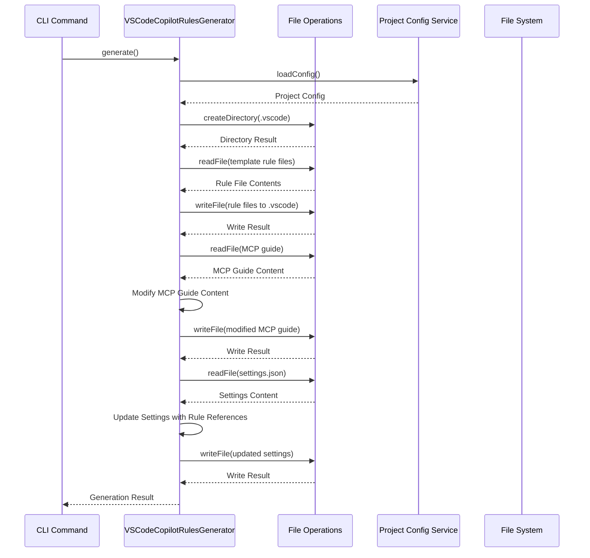

# Technical Specification: VSCodeCopilotRulesGenerator

## Overview

The `VSCodeCopilotRulesGenerator` is responsible for generating and configuring VS Code Copilot rules for a project. This specification outlines the enhanced functionality to restore the rule file copying and settings update capabilities previously implemented in `old-code/vscode-copilot-rules-generator.ts`.

## Component Purpose

The primary purpose of this component is to:

1. Generate VS Code Copilot configuration settings
2. Copy rule files from templates to the .vscode directory
3. Create a modified MCP usage rule file
4. Update settings.json to reference these rule files

## Dependencies

The component has the following dependencies:

- **IFileOperations**: For file system operations (reading, writing, directory creation)
- **ILogger**: For logging information and errors
- **IProjectConfigService**: For accessing project configuration
- **Container**: For dependency injection

## Interface

The `VSCodeCopilotRulesGenerator` implements the `IGenerator<string>` interface and extends the `BaseGenerator<string>` class:

```typescript
@Injectable()
export class VSCodeCopilotRulesGenerator
  extends BaseGenerator<string>
  implements IGenerator<string>
{
  readonly name = "vscode-copilot-rules";

  constructor(
    @Inject("Container") serviceContainer: Container,
    @Inject("IFileOperations") fileOperations: IFileOperations,
    @Inject("ILogger") logger: ILogger,
    @Inject("IProjectConfigService") projectConfigService: IProjectConfigService
  );

  protected validateDependencies(): Result<void, Error>;
  async validate(): Promise<Result<void, Error>>;
  protected async executeGeneration(): Promise<Result<string, Error>>;

  // New helper methods
  private async copyRuleFiles(baseDir: string, vscodeDir: string): Promise<Result<void, Error>>;
  private async copyAndModifyMcpGuide(baseDir: string, vscodeDir: string): Promise<Result<void, Error>>;
  private async updateSettingsJson(vscodeDir: string): Promise<Result<void, Error>>;
}
```

## Behavior

### Initialization

The generator is initialized with dependencies injected through the constructor. It validates that all required dependencies are available.

### Validation

Before execution, the generator validates that:

- All dependencies are resolved
- Project configuration can be loaded

### Execution

The execution process follows these steps:

1. Load project configuration
2. Ensure .vscode directory exists
3. Copy rule files from templates/rules to .vscode
4. Copy and modify MCP usage guide to create mcp-usage-rule.md
5. Update settings.json with rule file references

### Error Handling

The generator uses the Result pattern to handle errors:

- Each operation returns a Result<T, Error> indicating success or failure
- Errors are propagated up the call chain
- Detailed error messages include the specific operation that failed

## Data Flow



## File Structure

The generator interacts with the following files:

### Input Files

- `templates/rules/architect-rules.md`
- `templates/rules/code-rules.md`
- `templates/rules/code-review-rules.md`
- `templates/guide/vscode-mcp-usage-guide.md`
- `.vscode/settings.json` (if it exists)

### Output Files

- `.vscode/architect-rules.md`
- `.vscode/code-rules.md`
- `.vscode/code-review-rules.md`
- `.vscode/mcp-usage-rule.md`
- `.vscode/settings.json` (created or updated)

## Settings.json Structure

The generator updates settings.json with the following structure:

```json
{
  "github.copilot.chat.codeGeneration.instructions": [
    { "file": "architect-rules.md" },
    { "file": "code-rules.md" },
    { "file": "mcp-usage-rule.md" }
  ],
  "github.copilot.chat.reviewSelection.instructions": [
    { "file": "code-review-rules.md" },
    { "file": "mcp-usage-rule.md" }
  ]
  // Other existing settings are preserved
}
```

## Error Scenarios

The generator handles the following error scenarios:

1. **Project configuration not available**: Returns an error with a message indicating the configuration could not be loaded.
2. **Template files not found**: Returns an error with a message indicating which template file could not be found.
3. **Directory creation failure**: Returns an error with a message indicating the .vscode directory could not be created.
4. **File read/write failures**: Returns an error with a message indicating which file operation failed.
5. **Settings.json parsing errors**: Logs a warning and creates a new settings object.

## Testing Approach

The generator should be tested with the following scenarios:

1. **Happy path**: All files exist and operations succeed
2. **Missing template files**: Test behavior when template files are missing
3. **Existing settings.json**: Test merging with existing settings
4. **Invalid settings.json**: Test handling of invalid JSON in settings.json
5. **File system errors**: Test handling of permission errors or other file system issues

## Integration Points

The generator integrates with:

1. **CLI Command System**: Invoked through the CLI command infrastructure
2. **File Operations Service**: For all file system interactions
3. **Project Configuration Service**: For accessing project settings
4. **Logger Service**: For logging information and errors

## Performance Considerations

The generator performs multiple file system operations, which are inherently I/O-bound. However, the number of operations is small and the files are typically small, so performance impact should be minimal.

## Security Considerations

The generator only operates on files within the project directory, specifically in the .vscode subdirectory. It does not access sensitive information or external resources.

## Future Enhancements

Potential future enhancements could include:

1. **Configuration options**: Allow customization of which rule files to include
2. **Template customization**: Support for custom rule templates
3. **Rule validation**: Validate rule file content before copying
