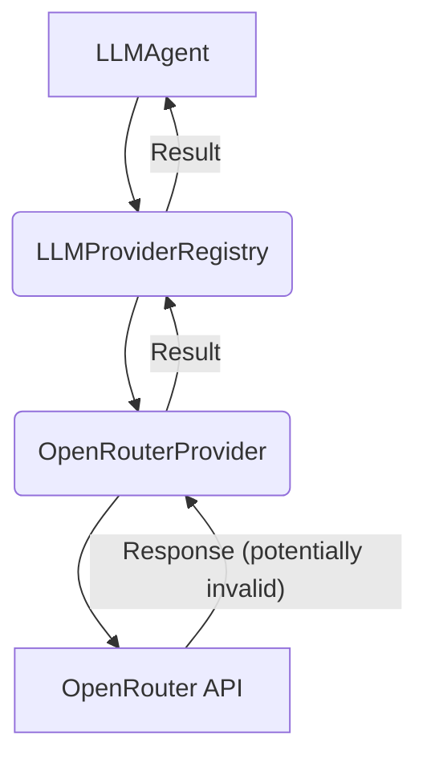

# Implementation Plan: Fix OpenRouter TypeError

**Task ID:** fix-openrouter-typeerror
**Task Name:** fix-openrouter-typeerror

## 1. Overview

This plan addresses the `TypeError: Cannot read properties of undefined (reading '0')` occurring in `OpenRouterProvider.getCompletion` when running the `ai-magic` generator. The error is caused by attempting to access properties on an `undefined` value within the OpenRouter API response structure. The fix involves adding robust checks to the response parsing logic to handle unexpected response formats gracefully.

**Key Objectives:**

- Resolve the `TypeError` in `OpenRouterProvider.getCompletion`.
- Implement resilient response parsing for the OpenRouter API.
- Ensure the `ai-magic` generator runs successfully with OpenRouter.

**Files to be Modified:**

- `src/core/llm/providers/open-router-provider.ts`
- `tests/core/llm/providers/open-router-provider.test.ts`

## 2. Implementation Context

The `OpenRouterProvider` is responsible for interacting with the OpenRouter API to fetch LLM completions. The current implementation in `getCompletion` assumes a specific structure for the API response (`data.choices[0].message.content`). When the API returns a response that deviates from this structure (e.g., `choices` is empty or missing, or `message` is missing), the application crashes with a `TypeError`.

The OpenRouter API documentation confirms that the response structure is normalized to comply with the OpenAI Chat API, where the expected structure includes a `choices` array containing objects with a `message` property, which in turn has a `content` property. However, robust parsing should still account for potential edge cases or future API changes where these properties might be missing or the array is empty.

The existing architecture uses the `Result` pattern for error handling, which is suitable for handling API response issues. The fix should leverage this pattern to return an `Err` result when the response structure is invalid, rather than throwing an unhandled exception.

## 3. Implementation Approach

The core approach is to enhance the response parsing logic in `OpenRouterProvider.getCompletion` by adding explicit checks for the existence of `data`, `data.choices`, and `data.choices[0]` before attempting to access nested properties. If any of these checks fail, the method should return a `Result.err` with a descriptive `LLMProviderError` indicating an invalid response format.

This approach is resilient to variations in the API response structure and aligns with the project's error handling patterns.

**Architectural Decisions:**

- **Robust Parsing:** Implement null/undefined checks at each level of the expected response structure (`data`, `data.choices`, `data.choices[0]`, `message`, `content`).
- **Result Pattern:** Utilize the `Result.err` to signal parsing failures, providing a clear error object with details about the invalid response.
- **Specific Error Type:** Use `LLMProviderError` with a specific error code (e.g., `INVALID_RESPONSE_FORMAT`) to distinguish this type of error.

**Component Diagram (Relevant Snippet):**



**Interface Definitions:**

No changes to existing interfaces (`ILLMProvider`, `LLMConfig`, `OpenRouterCompletionResponse`) are strictly necessary for this fix, as the issue is in the _handling_ of the response data, not the interface definition itself. However, the implementation will need to be mindful of the defined `OpenRouterCompletionResponse` interface and handle cases where the actual response does not conform.

## 4. Implementation Subtasks with Progress Tracking

### 1. Implement Robust Response Parsing and Error Handling in OpenRouterProvider

**Status**: Completed

**Description**: Modify the `getCompletion` method in `OpenRouterProvider` to add checks for `data`, `data.choices`, and `data.choices[0]` before accessing nested properties. If any check fails, return a `Result.err` with an `LLMProviderError` indicating an invalid response format. Update the existing check for missing `completion` content to also use a specific error code.

**Files to Modify**:

- `src/core/llm/providers/open-router-provider.ts` - Add null/undefined checks and update error handling logic.
- `tests/core/llm/providers/open-router-provider.test.ts` - Add new test cases for invalid response structures.

**Implementation Details**:

```typescript
  async getCompletion(systemPrompt: string, userPrompt: string): Promise<Result<string, Error>> {
    try {
      this.logger.debug(`Sending completion request to OpenRouter (model: ${this.config.model})`);

      const response = await fetch(`${this.apiUrl}/chat/completions`, {
        method: 'POST',
        headers: {
          Authorization: `Bearer ${this.apiKey}`,
          'Content-Type': 'application/json',
          'HTTP-Referer': 'https://github.com/roocode-generator',
          'X-Title': 'RooCode Generator',
        },
        body: JSON.stringify({
          model: this.config.model,
          messages: [
            { role: 'system', content: systemPrompt },
            { role: 'user', content: userPrompt },
          ],
          temperature: this.config.temperature,
          max_tokens: this.config.maxTokens,
        } as OpenRouterCompletionRequest),
      });

      if (!response.ok) {
        const errorData = (await response.json().catch(() => ({ error: response.statusText }))) as {
          error?: string;
        };
        const errorDetails: Record<string, unknown> = {
          statusCode: response.status,
          statusText: response.statusText,
          error: errorData.error,
        };
        throw new LLMProviderError(
          `OpenRouter API error: ${errorData.error || response.statusText}`,
          `HTTP_${response.status}`,
          this.name,
          errorDetails
        );
      }

      const data = (await response.json()) as OpenRouterCompletionResponse;

      // Perform robust checks for the expected structure
      if (!data || !Array.isArray(data.choices) || data.choices.length === 0) {
         throw new LLMProviderError(
          'OpenRouter response has invalid structure: missing or empty choices array',
          'INVALID_RESPONSE_FORMAT',
          this.name,
          { responseData: data } as Record<string, unknown>
        );
      }

      const firstChoice = data.choices[0];
      if (!firstChoice || !firstChoice.message) {
         throw new LLMProviderError(
          'OpenRouter response has invalid structure: first choice or message missing',
          'INVALID_RESPONSE_FORMAT',
          this.name,
          { responseData: data } as Record<string, unknown>
        );
      }

      const completion = firstChoice.message.content;

      if (completion === undefined || completion === null) {
        throw new LLMProviderError(
          'OpenRouter response missing completion content',
          'EMPTY_COMPLETION_CONTENT',
          this.name,
          { choices: data.choices } as Record<string, unknown>
        );
      }

      this.logger.debug(
        `Received completion from OpenRouter (model: ${this.config.model}, length: ${completion.length})`
      );

      return Result.ok(completion);
    } catch (error) {
      const err = error instanceof Error ? error : new Error(String(error));
      this.logger.error('Failed to get completion from OpenRouter', err);
      return Result.err(LLMProviderError.fromError(error, this.name));
    }
  }
```

**Testing Requirements**:

- Add unit tests to `OpenRouterProvider.test.ts` that mock the `fetch` call to return responses with:
  - Missing `choices` array.
  - Empty `choices` array.
  - `choices` array with an empty object or missing `message` property at index 0.
  - `choices[0].message` object missing the `content` property.
  - `choices[0].message.content` being explicitly `null`.
  - A valid response to ensure existing functionality is not broken.
- Verify that `getCompletion` returns `Result.err` with the correct `LLMProviderError` type and error code (`INVALID_RESPONSE_FORMAT` or `EMPTY_COMPLETION_CONTENT`) for invalid responses.
- Verify that `getCompletion` returns `Result.ok` with the correct completion string for valid responses.

**Acceptance Criteria**:

- [x] The `getCompletion` method correctly handles responses where `data`, `data.choices`, `data.choices[0]`, `data.choices[0].message`, or `data.choices[0].message.content` are missing, invalid, or null.
- [x] An `LLMProviderError` with a relevant error code (`INVALID_RESPONSE_FORMAT` or `EMPTY_COMPLETION_CONTENT`) is returned within a `Result.err` for invalid responses.
- [x] Existing tests for valid responses still pass.
- [x] New tests covering invalid response structures pass.

**Estimated effort**: 30-60 minutes

## 5. Testing Strategy

The primary testing strategy will be **unit testing** the `OpenRouterProvider`. We will mock the `fetch` API call to simulate various valid and invalid API responses from OpenRouter. This allows us to isolate the `OpenRouterProvider` logic and verify its error handling and parsing capabilities without making actual network requests.

**Key Test Cases:**

- **Valid Response:** Simulate a standard successful response with a valid completion string.
- **Missing `choices`:** Simulate a response where the top-level `choices` property is missing.
- **Empty `choices`:** Simulate a response where the `choices` array is present but empty.
- **Missing `choices[0]`:** Simulate a response where `choices` is an array but the first element is missing or null.
- **Missing `message`:** Simulate a response where `choices[0]` is present but the `message` property is missing.
- **Missing `content`:** Simulate a response where `choices[0].message` is present but the `content` property is missing or null.
- **Null `content`:** Simulate a response where `choices[0].message.content` is explicitly `null`.
- **HTTP Error Response:** Ensure existing error handling for non-2xx HTTP statuses is still functional.

We will use `jest.mock('node-fetch')` or similar mocking techniques to control the responses received by the `OpenRouterProvider`.

## 6. Implementation Sequence

1. Implement Robust Response Parsing and Error Handling in OpenRouterProvider.

## 7. Documentation Update Needs

- Update `memory-bank/TechnicalArchitecture.md` if the approach to handling LLM provider response variations introduces a new pattern or significant change to the overall LLM integration architecture (unlikely for this specific fix, but worth noting).
- Update `memory-bank/DeveloperGuide.md` if new error handling patterns or specific `LLMProviderError` codes are introduced that developers should be aware of.
