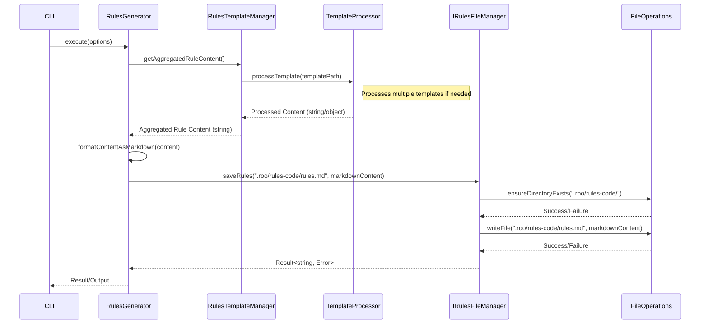

# Implementation Plan: Update Rules Generator Output Format (task-001)

## 1. Overview

This plan details the steps required to refactor the `RulesGenerator` component within the `roocode-generator` project. The primary goal is to change the output format from multiple versioned JSON files in `.roo/rules/` to a single, aggregated Markdown file located at `.roo/rules-code/rules.md`. This new format should resemble the structure and style of the existing `.roo/rules-code/guidline-rules.md` example file, using Markdown headings for rule categorization.

This refactoring addresses the requirements outlined in `task-tracking/task-001/task-description.md`.

## 2. Architecture Decision Record (ADR)

**Context:**

- The current `RulesGenerator` produces multiple JSON files, making it difficult to consume and maintain a unified view of all rules.
- The desired output is a single, human-readable Markdown file (`.roo/rules-code/rules.md`) consolidating all rules.
- The system already has components for template processing (`RulesTemplateManager`, `TemplateProcessor`) and file management (`IRulesFileManager`, `FileOperations`).
- Project standards emphasize using existing patterns (DI, Result) and minimizing external dependencies.

**Decision:**

- Refactor the existing `RulesGenerator`, `IRulesFileManager`, and potentially `RulesTemplateManager`/`TemplateProcessor` to support the generation of a single Markdown file.
- Modify `IRulesFileManager` to handle writing a single file to the new path (`.roo/rules-code/rules.md`).
- Update `RulesGenerator` to aggregate rule content (likely fetched via `RulesTemplateManager`) and format it into the required Markdown structure before passing it to `IRulesFileManager`.
- Remove the logic related to generating multiple JSON files, version tracking (`.roo/rules-versions.json`), and backups associated with the old format, as it's no longer required for a single, potentially overwritten file.

**Consequences:**

- **Positive:**
  - Provides a single, consolidated, human-readable rules file.
  - Simplifies the output structure in the `.roo/` directory.
  - Aligns the output format with the example guideline file.
  - Reduces complexity by removing multi-file management and versioning logic.
- **Negative:**
  - Removes the previous capability of having distinct, versioned rule files (though this wasn't explicitly required to be maintained).
  - Requires careful refactoring of existing components and tests.

**Alternatives Considered:**

- **Create New Components:** Introduce entirely new components specifically for Markdown generation. Rejected because existing components can be adapted, aligning with the principle of leveraging existing code and minimizing redundancy.
- **Use External Markdown Library:** Integrate a third-party library for Markdown generation. Rejected as the required Markdown structure is simple (headings, bullet points) and can be easily generated using string manipulation or basic templating, avoiding an unnecessary external dependency.

## 3. Component Architecture

The core components involved in rules generation will interact as follows:

```mermaid
graph TD
    A[CLI Command: generate --generators rules] --> B(RulesGenerator);
    B --> C{RulesTemplateManager};
    C --> D(TemplateProcessor);
    D -- Loads/Processes --> E[Rule Templates (.md/.txt)];
    C -- Returns Aggregated Content --> B;
    B -- Formats Markdown --> B;
    B -- Passes Formatted Content & Path --> F(IRulesFileManager);
    F -- Uses --> G(FileOperations);
    G -- Writes --> H([.roo/rules-code/rules.md]);

    style F fill:#f9f,stroke:#333,stroke-width:2px
    style H fill:#ccf,stroke:#333,stroke-width:1px
```

- **RulesGenerator:** Orchestrates the process, fetches aggregated rule content, formats it into Markdown, and uses `IRulesFileManager` to save it.
- **RulesTemplateManager:** Responsible for finding and potentially aggregating content from rule templates. (May need minor adjustments depending on how aggregation is handled).
- **TemplateProcessor:** Processes individual templates. (Likely unchanged unless template structure needs modification for aggregation).
- **IRulesFileManager:** Interface defining how rules files are saved. Implementation will be updated to write a single Markdown file.
- **FileOperations:** Low-level utility for file system interactions (writing files, creating directories).

## 4. Interface Changes

- **`IRulesFileManager` (`src/generators/rules/rules-file-manager.ts`)**:
  - The primary method (likely `saveRules` or similar) will need modification.
  - **Current (Example):** `saveRules(mode: string, version: string, content: object): Result<string, Error>` (Hypothetical, based on multi-file JSON output)
  - **Proposed:** `saveRules(filePath: string, content: string): Result<string, Error>`
    - `filePath`: The full path to the output file (`.roo/rules-code/rules.md`).
    - `content`: The complete, aggregated Markdown content as a string.
    - The return type remains `Result<string, Error>`, indicating success (with the path) or failure.
  - Methods related to versioning (`saveVersionInfo`, `readVersionInfo`) or managing multiple files should be removed.

## 5. Data Flow



This diagram shows the flow from the initial command through template processing, aggregation, Markdown formatting, and finally writing the single file using the updated `IRulesFileManager`.

## 6. Implementation Subtasks

### 1. Refactor `IRulesFileManager` Interface and Implementation

**Description**: Update the `IRulesFileManager` interface (`src/generators/rules/rules-file-manager.ts`) and its concrete implementation to handle saving a single string content to a specified file path. Remove methods related to multi-file JSON output, versioning, and backups.
**Dependencies**: None
**Implementation Details**:

```typescript
// src/generators/rules/rules-file-manager.ts (Interface Example)
export interface IRulesFileManager {
  saveRules(filePath: string, content: string): Result<string, Error>;
  // Remove old methods like saveVersionInfo, readVersionInfo, etc.
}

// src/generators/rules/rules-file-manager.impl.ts (Implementation Snippet)
@injectable()
export class RulesFileManager implements IRulesFileManager {
  constructor(@inject(TYPES.FileOperations) private fileOps: IFileOperations) {}

  saveRules(filePath: string, content: string): Result<string, Error> {
    try {
      const dirPath = path.dirname(filePath);
      // Ensure directory exists
      const dirResult = this.fileOps.ensureDirectoryExists(dirPath);
      if (dirResult.isErr()) {
        return err(new Error(`Failed to ensure directory ${dirPath}: ${dirResult.error.message}`));
      }

      // Write the file
      const writeResult = this.fileOps.writeFile(filePath, content);
      if (writeResult.isErr()) {
        return err(new Error(`Failed to write file ${filePath}: ${writeResult.error.message}`));
      }
      return ok(filePath); // Return path on success
    } catch (error) {
      return err(new Error(`Unexpected error saving rules to ${filePath}: ${error.message}`));
    }
  }
  // Remove implementations of old methods
}
```

**Testing Requirements**:

- Unit tests for `RulesFileManager`: - Verify `saveRules` calls `fileOps.ensureDirectoryExists` and `fileOps.writeFile` with correct paths and content. - Verify successful file write returns `ok(filePath)`. - Verify errors from `fileOps` are correctly propagated as `err`. - Verify removed methods no longer exist/are not callable.
  **Acceptance Criteria**:
- [ ] `IRulesFileManager` interface updated with the new `saveRules` signature.
- [ ] Old methods related to versioning/multi-file handling removed from the interface.
- [ ] `RulesFileManager` implementation updated to match the new interface.
- [ ] Implementation correctly uses `FileOperations` to ensure directory and write file.
- [ ] Implementation correctly handles and returns `Result` objects for success and errors.
- [ ] Old implementation logic removed.
      **Estimated effort**: 30 minutes

### 2. Update `RulesTemplateManager` / `TemplateProcessor` (If Necessary)

**Description**: Assess `RulesTemplateManager` and `TemplateProcessor` (`src/generators/rules/rules-template-manager.ts`, `src/core/templates/template-processor.ts`). If they are currently designed to return structured data per template/mode for JSON generation, update them to return raw or minimally processed content suitable for aggregation into a single Markdown string by the `RulesGenerator`. If they already return simple string content, this task might be minimal.
**Dependencies**: Subtask 1 (potentially, if interfaces change)
**Implementation Details**:

- Analyze the current return types of methods like `getRuleContent` or similar in `RulesTemplateManager`.
- If returning complex objects, modify to return simpler structures or raw strings.
- Ensure template processing logic in `TemplateProcessor` doesn't interfere with Markdown structure if templates are already `.md`.

```typescript
// src/generators/rules/rules-template-manager.ts (Conceptual)
async getAggregatedRuleContent(): Promise<Result<string, Error>> {
  // Logic to find relevant rule templates
  const templatePaths = await this.findRuleTemplates(); // Example method
  let aggregatedContent = "";
  for (const templatePath of templatePaths) {
    const result = await this.templateProcessor.processTemplate(templatePath, {}); // Assuming processTemplate returns string content
    if (result.isOk()) {
      // Add formatting (e.g., headings based on template name/path)
      aggregatedContent += `## ${this.getSectionTitle(templatePath)}\n\n${result.value}\n\n`;
    } else {
      // Handle error - maybe log and skip? Or return err()
      console.warn(`Skipping template ${templatePath} due to error: ${result.error.message}`);
    }
  }
  if (aggregatedContent === "") {
      return err(new Error("No rule content could be aggregated."));
  }
  return ok(aggregatedContent);
}
```

**Testing Requirements**:

- Unit tests for `RulesTemplateManager`: - Verify it correctly finds and processes templates. - Verify it aggregates content from multiple templates into a single string. - Verify appropriate Markdown formatting (like headings) is added during aggregation. - Verify error handling for failing template processing.
  **Acceptance Criteria**:
- [ ] `RulesTemplateManager` provides a method to get aggregated content suitable for Markdown generation.
- [ ] Content from different sources/templates is combined correctly.
- [ ] Necessary formatting (e.g., Markdown headings) is applied during aggregation.
- [ ] Errors during processing of individual templates are handled gracefully.
      **Estimated effort**: 30 minutes (assuming minor changes needed)

### 3. Refactor `RulesGenerator`

**Description**: Update the main `RulesGenerator` (`src/generators/rules/rules-generator.ts`) to use the modified `RulesTemplateManager` (if changed) and `IRulesFileManager`. It should orchestrate fetching the aggregated rule content, potentially applying final formatting, and calling `IRulesFileManager.saveRules` with the correct path (`.roo/rules-code/rules.md`) and the final Markdown string. Remove logic related to generating multiple JSON files.
**Dependencies**: Subtask 1, Subtask 2
**Implementation Details**:

```typescript
// src/generators/rules/rules-generator.ts (Conceptual)
@injectable()
export class RulesGenerator implements IGenerator {
  // ... dependencies (RTM, IRFM) injected via constructor

  async generate(options: any): Promise<Result<string[], Error>> {
    this.progressIndicator.start('Generating rules...'); // Example progress
    try {
      // 1. Get aggregated content from RulesTemplateManager
      const contentResult = await this.rulesTemplateManager.getAggregatedRuleContent(); // Assuming method from Subtask 2
      if (contentResult.isErr()) {
        this.progressIndicator.fail('Failed to get rule content.');
        return err(contentResult.error);
      }
      const markdownContent = contentResult.value; // Already formatted Markdown

      // 2. Define the output path
      const outputPath = path.join('.roo', 'rules-code', 'rules.md');

      // 3. Save using the updated RulesFileManager
      const saveResult = this.rulesFileManager.saveRules(outputPath, markdownContent);
      if (saveResult.isErr()) {
        this.progressIndicator.fail('Failed to save rules file.');
        return err(saveResult.error);
      }

      this.progressIndicator.succeed('Rules generated successfully.');
      return ok([outputPath]); // Return the path of the generated file
    } catch (error) {
      this.progressIndicator.fail('Unexpected error during rule generation.');
      return err(new Error(`Unexpected error in RulesGenerator: ${error.message}`));
    }
  }
  // Remove old methods/logic for multi-file JSON generation
}
```

**Testing Requirements**:

- Unit tests for `RulesGenerator`: - Mock `RulesTemplateManager` and `IRulesFileManager`. - Verify `generate` calls `getAggregatedRuleContent`. - Verify `generate` calls `saveRules` on `IRulesFileManager` with the correct path (`.roo/rules-code/rules.md`) and the content received from the template manager. - Verify success returns `ok` with the output path. - Verify errors from dependencies are propagated correctly as `err`. - Verify progress indicators are used.
  **Acceptance Criteria**:
- [ ] `RulesGenerator` correctly orchestrates the new flow.
- [ ] It fetches aggregated content from `RulesTemplateManager`.
- [ ] It calls the updated `saveRules` method on `IRulesFileManager` with the correct arguments.
- [ ] Old logic for generating multiple JSON files is removed.
- [ ] Success and error results (`Result` type) are handled correctly.
- [ ] Progress indication is implemented.
      **Estimated effort**: 30 minutes

### 4. Update/Add Tests

**Description**: Update existing unit tests for `RulesGenerator`, `RulesFileManager`, and `RulesTemplateManager` to reflect the changes made in previous subtasks. Add new tests where necessary to ensure adequate coverage of the new logic (single file output, Markdown format, aggregation). Add an integration test (or modify an existing one) that runs the generator and verifies the creation and basic content/format of `.roo/rules-code/rules.md`.
**Dependencies**: Subtask 1, Subtask 2, Subtask 3
**Implementation Details**:

- Locate existing test files (e.g., `tests/generators/rules-generator.test.ts`, potentially others for file manager/template manager).
- Modify test setups, mocks, and assertions to align with the new single-file Markdown output.
- Check test coverage reports and add tests for any uncovered lines/branches in the modified code.
- Create/update an integration test that: - Sets up a test environment (e.g., mock templates). - Runs the `RulesGenerator.generate()` method. - Asserts that `.roo/rules-code/rules.md` is created. - Asserts that the file content is valid Markdown and contains expected sections/rules based on the mock templates. - Cleans up generated files.
  **Testing Requirements**:
- All unit tests for modified components pass.
- Integration test(s) for the rules generator pass, verifying file creation and basic content.
- Test coverage meets project standards.
  **Acceptance Criteria**:
- [ ] Existing unit tests are updated and passing.
- [ ] New unit tests added for new logic/paths.
- [ ] Integration test(s) successfully verify the end-to-end generation of `rules.md`.
- [ ] Test coverage is maintained or improved.
      **Estimated effort**: 30 minutes

## 7. Implementation Sequence

1.  **Refactor `IRulesFileManager` Interface and Implementation (Subtask 1)**
    - Dependencies: None
    - Enables: Subtask 3, Subtask 4
2.  **Update `RulesTemplateManager` / `TemplateProcessor` (If Necessary) (Subtask 2)**
    - Dependencies: None (potentially Subtask 1 if interfaces changed significantly, but unlikely)
    - Enables: Subtask 3, Subtask 4
3.  **Refactor `RulesGenerator` (Subtask 3)**
    - Dependencies: Subtask 1, Subtask 2
    - Enables: Subtask 4
4.  **Update/Add Tests (Subtask 4)**
    - Dependencies: Subtask 1, Subtask 2, Subtask 3
    - Completes the implementation.

_Note: Subtasks 1 and 2 can potentially be worked on in parallel._

## 8. Risk Assessment

- **Risk 1:** Complexity in `RulesTemplateManager` aggregation logic.
  - Mitigation: Start with a simple aggregation approach (concatenating template content with generated headers). Refine if necessary based on template structure. Thorough unit testing of the aggregation logic.
- **Risk 2:** Existing tests might be heavily tied to the old JSON structure.
  - Mitigation: Allocate sufficient time in Subtask 4 for test refactoring. Focus tests on verifying the _intent_ (correct rules are present, format is Markdown) rather than exact JSON structure.
- **Risk 3:** Unforeseen dependencies on the old multi-file/versioning system elsewhere.
  - Mitigation: Perform code searches for usages of the old `IRulesFileManager` methods or the `.roo/rules/` path and `.roo/rules-versions.json` file before removing them completely. (Likely low risk as this seems self-contained).

## 9. Testing Strategy

- **Unit Testing:** Each modified component (`RulesGenerator`, `RulesFileManager`, `RulesTemplateManager`) will have comprehensive unit tests using Jest mocks to isolate dependencies. Tests will cover:
  - Correct interaction with dependencies (mocks).
  - Handling of success and error `Result` objects.
  - Correct processing/aggregation/formatting logic.
  - Edge cases (e.g., no templates found, file system errors).
- **Integration Testing:** At least one integration test will run the `RulesGenerator` against a controlled set of mock templates and a mock file system (or a real temporary directory). This test will verify:
  - The `generate` command completes successfully.
  - The file `.roo/rules-code/rules.md` is created in the correct location.
  - The file content is valid Markdown.
  - The content includes expected sections and rules derived from the mock templates.
- **Manual Verification:** After implementation, manually run the generator command and inspect the generated `rules.md` file for correctness and adherence to the `guidline-rules.md` style.

## 10. Verification Checklist

- [ ] Implementation plan follows the required template (`implementation-plan-template.md`).
- [ ] Architecture Decision Record (ADR) is documented with rationale.
- [ ] Component diagram included and accurately reflects the planned changes.
- [ ] Interface changes (`IRulesFileManager`) are clearly defined.
- [ ] Data flow diagram illustrates the new process.
- [ ] Subtasks are detailed with descriptions, implementation notes, testing requirements, acceptance criteria, and estimated effort.
- [ ] Implementation sequence is logical and dependencies are noted.
- [ ] Risk assessment identifies potential issues and mitigation strategies.
- [ ] Testing strategy covers unit, integration, and manual verification.
- [ ] All diagrams and code examples render correctly in Markdown.
